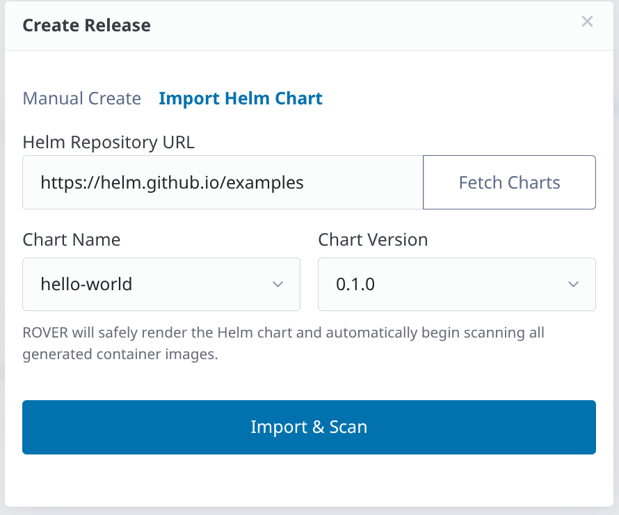

# R.O.V.E.R

**R**elease **O**riented **V**ulnerability **E**valuation & **R**eporting

A lightweight, Falcon-backed security dashboard for aggregating and reporting multi-repository vulnerability scans across release tags.

Planned features and architectural specifications are tracked in the [OKF Vault Roadmap MOC](okf-vault/40_indices/roadmap-moc.md). User and developer documentation is available at [docs/starlight](docs/starlight/src/content/docs/guides/notifications.md).



---

## Key Capabilities & Features

- **Multi-Scanner Security Auditing**: Parallel evaluation of Git repositories and container images using Trivy (CVE & dependency scanning), Semgrep (SAST), and Snyk.
- **Automated Scan Schedules**: Recurring cron schedules for continuous release package monitoring.
- **Event-Driven Notifications**: Real-time multi-channel alerts (Webhooks with HMAC signatures, Slack/Teams, SMTP Email, AWS SES) triggered on scan completion, scan failures, vulnerability findings, and advance EOL lead-time warnings.
- **Default System Email Gateway**: System Admins configure server-wide SMTP/SES gateways so standard users can subscribe their registered email to personal alerts without requiring administrative credentials.
- **OpenBao Credential Vault**: Dynamic encryption for scanner API tokens, Git repository SSH keys, container registry secrets, and notification channel credentials stored securely in OpenBao Vault.
- **OCI Repository Discovery**: Automatic correlation of compiled container images back to their originating Git source repositories using standard `org.opencontainers.image.source` OCI annotations.
- **CI/CD Pipeline Ingestion**: REST API endpoints and token-authenticated ingestion for automated pipeline runs.

---

## Getting Started

ROVER is Docker-first. All services (the Falcon web application, PostgreSQL database, OpenBao secrets engine with auto-unseal sidecar, Authelia identity provider, and Nginx reverse proxy) are orchestrated with Docker Compose. The Docker daemon is a hard dependency; it is used both to run the stack and to execute ephemeral scanner containers.

### Prerequisites

- [Docker](https://docs.docker.com/get-docker/) with Compose plugin
- `python3` with `uv` package manager installed
- Poe the Poet (`poe`) task runner

### First-Time Setup

#### 1. Clone the repository

```bash
git clone https://github.com/kajuberdut/ROVER.git && cd ROVER
```

#### 2. Run setup

Generates all TLS certificates, secrets, and OpenBao AppRole credentials:

```bash
poe setup
```

The setup task will:
- Generate a self-signed TLS certificate for `*.rover.local`
- Generate random secrets for Authelia OIDC authentication
- Prompt for an admin user password
- Provision the persistent OpenBao secrets engine and AppRole credentials
- Print a `/etc/hosts` reminder for local domain mapping

#### 3. Add local host entries

```text
127.0.0.1 rover.local auth.rover.local
```

#### 4. Start the stack

```bash
poe up
```

#### 5. Promote your admin user

Navigate to **https://rover.local** and log in with your Authelia credentials. Then run:

```bash
poe promote-admin admin@rover.local
```

> **Note:** Because local development certificates are self-signed, your browser will display a privacy warning on first visit. Click **Advanced → Proceed** to continue.

---

## User Roles & Access Control

ROVER uses role-based access control (RBAC) layered on top of Authelia authentication. User roles are managed by System Admins via `/admin/users`.

| Capability | Email-Only | Viewer | Product Owner | System Admin |
|---|:---:|:---:|:---:|:---:|
| Self-service subscriptions (`/user/subscriptions`) | ✅ | ✅ | ✅ | ✅ |
| Email verification & password reset | ✅ | ✅ | ✅ | ✅ |
| View dashboards & reports | ❌ | ✅ | ✅ | ✅ |
| Trigger manual scan evaluations | ❌ | ✅ | ✅ | ✅ |
| Personal notifications & API tokens | ❌ | ✅ | ✅ | ✅ |
| Create products | ❌ | ❌ | ✅ (becomes owner) | ✅ |
| Modify owned products & releases | ❌ | ❌ | ✅ | ✅ |
| Modify any product or release | ❌ | ❌ | ❌ | ✅ |
| Manage product notification rules | ❌ | ❌ | ✅ (owned) | ✅ |
| Manage system destinations (`/admin/notifications/destinations`) | ❌ | ❌ | ❌ | ✅ |
| System configuration & user role assignment | ❌ | ❌ | ❌ | ✅ |

New users are assigned the `viewer` role by default on first login. Users assigned the `email_only` role are restricted strictly to managing their email subscription preferences at `/user/subscriptions`.

---

## Architecture Overview

- **Web Application**: Falcon ASGI application with OIDC session authentication.
- **Authentication**: [Authelia](https://www.authelia.com/) handles OpenID Connect identity management.
- **Secrets Management**: [OpenBao](https://openbao.org/) provides dynamic secret encryption for credentials, tokens, and notification passwords with an automated unseal sidecar (`openbao-unseal`).
- **Reverse Proxy**: Nginx terminates TLS and routes `rover.local` → Falcon and `auth.rover.local` → Authelia.
- **Job Engine**: PostgreSQL-backed job queue (`rover.db.jobs`) and async background worker (`worker.py`) running parallel scanner tasks without heavy external message brokers.
- **Scanner Containers**: Ephemeral, isolated Docker containers executing Trivy, Semgrep, and Snyk scans with commit-hash caching to prevent redundant execution.
- **Notification Engine**: Asynchronous multi-channel dispatch engine sending alerts via Webhook (HMAC signed), Slack, SMTP Email, and AWS SES.

---

## Disclaimer of Affiliation and Third-Party Trademarks

Trivy, Semgrep, and Snyk are trademarks of their respective owners. Any reference to these tools within R.O.V.E.R. is strictly for informational and compatibility purposes. No association, sponsorship, or endorsement exists between R.O.V.E.R. and the owners of these trademarks.

---

## Credits & Origins

ROVER's internal database migration system, **shipship**, is a refactored version of the [yoyo-migrations](https://github.com/ollycope/yoyo) library by Oliver Cope. The name **shipship** refers to the **Ship of Theseus** paradox.
