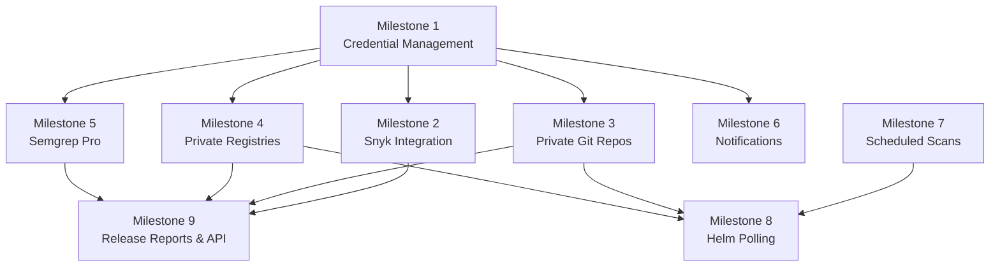

# ROVER — Feature Roadmap

## Overview

This roadmap covers the planned feature set for R.O.V.E.R (Release Oriented Vulnerability Evaluation & Reporting). Features are grouped into thematic milestones. Items marked with a dependency note cannot be started until their prerequisite milestone is complete.

---

## Milestone 1 — Credential Management

> **Foundation for Milestones 2–5 and 7.** Everything that requires authentication or private access depends on this infrastructure.

### 1.1 · Credential Vault

Provide a secure, admin-managed store for named secrets. Credentials are referenced by other features by name rather than inline values, so they are never duplicated in configuration.

**Scope:**
- Admin UI for CRUD operations on named credentials (type-tagged: git token, registry token, Snyk token, Semgrep token, SMTP password, etc.)
- Encrypted-at-rest storage (using Python `cryptography` / Fernet with a key derived from the Authelia `encryption_key` already in the stack, or a separately generated app secret)
- Credentials are **write-once visible** in the UI — values are masked after creation; the user may only replace or delete them
- Credentials are **scoped** to the system (global) or to a specific Product (product-level override)

**Dependencies:** None  
**Enables:** 1.2, 2, 3, 4, 5, 7

---

## Milestone 2 — Snyk Integration

Expand ROVER's scanner suite with Snyk for both SAST and supply-chain (OSS/CVE) analysis.

### 2.1 · Snyk Authentication (via Credential Vault)

- Add a `snyk_token` credential type to the Vault
- Worker picks up the stored token and injects it into the Snyk container environment at scan time
- Graceful fallback: if no token is stored, Snyk runs unauthenticated (limited rate / features)

**Dependencies:** 1.1

### 2.2 · Snyk Supply Chain (OSS / CVE)

- Launch ephemeral `snyk/snyk` container (pinned to an immutable `sha256` digest, consistent with the existing supply-chain hardening policy)
- Scan Git repository assets for known OSS vulnerabilities
- Persist results in a new `snyk_oss_findings` table (mirroring the existing `trivy` results schema)
- Surface results in a new **Snyk OSS** tab on the report page (parallel to the Trivy tab)

**Dependencies:** 2.1

### 2.3 · Snyk Code (SAST)

- Extend the above to invoke Snyk Code analysis on repository assets
- Persist results in a new `snyk_sast_findings` table
- Surface results in a new **Snyk Code** tab on the report page (parallel to the Semgrep tab)
- Cache by commit SHA (same strategy already used for Semgrep)

**Dependencies:** 2.1

---

## Milestone 3 — Private Source Repository Support

Allow ROVER to clone and scan private Git repositories by injecting saved credentials at clone time.

### 3.1 · Git Credential Injection

- Add a `git_token` credential type to the Vault
- Credential is associated with a hostname (e.g., `github.com`, `gitlab.myco.com`)
- When the `alpine/git` cloning step runs in `scanner.py`, inject the token via `GIT_ASKPASS` or a rewritten HTTPS URL (e.g., `https://<token>@github.com/…`)
- Token is never written to disk or logged

### 3.2 · Private Helm Repository Pull

- Extend Helm chart loading (OCI and HTTP) to authenticate using a stored `helm_token` credential
- Pass credentials to `helm pull` or `skopeo copy` as appropriate

**Dependencies:** 1.1

---

## Milestone 4 — Private Container Registry Support

Allow ROVER to pull and scan images from registries that require authentication.

### 4.1 · Registry Credential Injection

- Add a `registry_token` credential type to the Vault, keyed by registry hostname
- When Trivy or `skopeo` accesses an image, inject registry auth via Docker config JSON or the tool's native `--registry-auth` flag
- Support the standard `username:password` and token formats

**Dependencies:** 1.1

---

## Milestone 5 — Semgrep Pro Authentication

Enable the Semgrep Pro engine and auth-gated rulesets by authenticating with a saved token.

### 5.1 · Semgrep Token Injection

- Add a `semgrep_token` credential type to the Vault
- Inject `SEMGREP_APP_TOKEN` into the ephemeral Semgrep container environment
- UI indicator on the scan report shows whether a scan used the free or Pro engine

**Dependencies:** 1.1

---

## Milestone 6 — Notifications

Deliver per-product alerts to keep teams informed of new findings without manual dashboard polling.

### 6.1 · SMTP Credential & Configuration

- Admin UI to configure one or more named SMTP profiles (host, port, sender address, TLS mode)
- SMTP password stored in the Credential Vault (type: `smtp_password`)
- Uses Python `smtplib` from the standard library (no additional dependency)

**Dependencies:** 1.1

### 6.2 · Notification Rules

- Per-product notification settings:
  - **Every scan** — email on completion regardless of findings
  - **New vulnerabilities only** — email only when a scan introduces a finding not present in the previous scan for that asset
- Recipient list configurable per-product (can include non-ROVER users)
- Notification includes: product name, release, asset, scanner, severity counts, link to report

### 6.3 · Notification Delivery

- Worker sends emails after each job completes using the configured SMTP profile
- Failed deliveries are logged; no retry storm (single attempt with logged failure)

**Dependencies:** 6.1, 6.2

---

## Milestone 7 — Scheduled Scans

Automate recurring vulnerability scans on a configurable cadence rather than requiring manual triggers.

### 7.1 · Scan Schedule Configuration

- Per-release schedule settings (cron-style or simple interval: hourly / daily / weekly)
- Schedules stored in the existing SQLite database alongside release metadata
- Admin and Product Owner can configure schedules for their releases

### 7.2 · Schedule Executor

- Worker loop checks for releases with a due scheduled scan on each iteration (low-overhead polling, consistent with the existing `scan_queue.py` architecture)
- Enqueues scan jobs for all assets in the release when the schedule fires
- Respects Semgrep commit-hash caching — Semgrep jobs are only enqueued if commits have changed since the last scan

**Dependencies:** None (Notifications optional but recommended as a companion feature)

---

## Milestone 8 — Helm Chart Version Polling

Detect when new versions of tracked Helm charts are published and automatically promote releases.

### 8.1 · Helm Version Watcher

- For each release that has a Helm chart asset, periodically poll the chart repository (OCI or HTTP) for newer versions
- Compare the current pinned chart version against available versions using semantic versioning rules
- Store discovered versions in a `helm_chart_versions` tracking table

### 8.2 · Automated Release Promotion

- Define promotion rules per-release (e.g., `RC* → RC*+1`, `Dev* → RC1`)
- When the watcher finds a qualifying new version, create a new Release record inheriting all asset associations from the current release, bump the version label, and enqueue a full scan
- Admin approval gate (optional): promotion can be configured to require an admin to confirm before the new release is made active

**Dependencies:** Milestone 7 (for the scheduled polling heartbeat), Milestone 3/4 (for private chart repos)

---

## Milestone 9 — Release Reports & API

Provide a machine-readable, exportable summary of all ROVER-tracked data for a given release.

### 9.1 · Release Report (JSON)

A single structured JSON document per release that consolidates:

```
{
  "release": { ... },           // metadata, version, timestamps
  "assets": [                   // one entry per tracked asset
    {
      "asset": { ... },
      "trivy": { ... },         // latest Trivy results
      "semgrep": { ... },       // latest Semgrep results
      "snyk_oss": { ... },      // latest Snyk OSS results (if enabled)
      "snyk_sast": { ... }      // latest Snyk Code results (if enabled)
    }
  ],
  "summary": {                  // rolled-up counts by severity
    "critical": 0, "high": 0, "medium": 0, "low": 0
  }
}
```

- Downloadable from the release dashboard via a **Download Report** button
- Schema is versioned (`"schema_version": "1.0"`) to support forward compatibility

### 9.2 · Report API Endpoint

- `GET /api/v1/releases/{release_id}/report` — returns the JSON report from 9.1
- Authenticated via ROVER session cookie (existing OIDC session) **or** a static API token (new `rover_api_token` credential type, scoped to read-only report access)
- `Accept: application/json` header triggers JSON response; `Accept: text/html` falls back to the existing dashboard UI (consistent with Falcon's responder pattern)
- Documented in a new `docs/api.md` reference page

**Dependencies:** All scan-related milestones (results must exist to be reported); 9.1 must precede 9.2

---

## Dependency Map



---

## Open Questions

> [!IMPORTANT]
> **Credential encryption key**: Fernet encryption requires a stable key. Options are: (a) derive from the existing Authelia `encryption_key`, (b) generate a new `ROVER_SECRET_KEY` at `setup.sh` time. Which do you prefer?

> [!IMPORTANT]
> **Notification triggers**: Should "new vulnerabilities only" diff against the immediately preceding scan for the same asset, or against any prior scan (i.e., alert only on net-new CVE IDs never previously seen for that release)?

> [!IMPORTANT]
> **Helm promotion approval gate**: Should this be opt-in per-release, opt-out per-release, or a global admin setting?

> [!IMPORTANT]
> **API authentication**: Should the Report API support static bearer tokens in addition to the OIDC session? If yes, should token issuance live under the existing admin user panel or be a separate concept?
