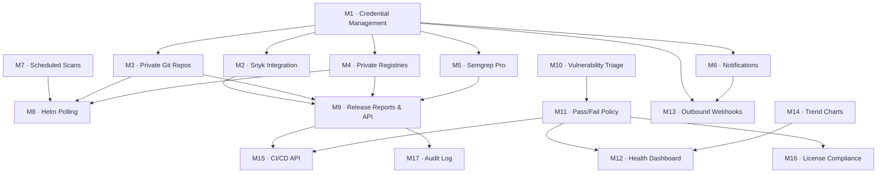

# ROVER — Feature Roadmap

## Overview

This roadmap covers the planned feature set for R.O.V.E.R (Release Oriented Vulnerability Evaluation & Reporting). Features are grouped into thematic milestones. Items marked with a dependency note cannot be started until their prerequisite milestone is complete.

Milestones 1–9 cover the originally scoped feature set. Milestones 10–13 are **MVP gaps** — features that are difficult to omit if ROVER is to be used as a day-to-day operational tool. Milestones 14–16 are **high-value additions** planned for later versions.

---

## Milestone 1 — Credential Management

> **Foundation for Milestones 2–5 and 7.** Everything that requires authentication or private access depends on this infrastructure.

### 1.1 · Credential Vault

Provide a secure, admin-managed store for named secrets. Credentials are referenced by other features by name rather than inline values, so they are never duplicated in configuration.

**Scope:**
- Admin UI for CRUD operations on named credentials (type-tagged: git token, registry token, Snyk token, Semgrep token, SMTP password, etc.)
- Encrypted-at-rest storage (using Python `cryptography` / Fernet with a key derived from the Authelia `encryption_key` already in the stack, or a separately generated app secret)
- Credentials are **write-once visible** in the UI — values are masked after creation; the user may only replace or delete them
- Credentials are **scoped** to the system (global) or to a specific Product (product-level override)

**Dependencies:** None  
**Enables:** 1.2, 2, 3, 4, 5, 7

---

## Milestone 2 — Snyk Integration

Expand ROVER's scanner suite with Snyk for both SAST and supply-chain (OSS/CVE) analysis.

### 2.1 · Snyk Authentication (via Credential Vault)

- Add a `snyk_token` credential type to the Vault
- Worker picks up the stored token and injects it into the Snyk container environment at scan time
- Graceful fallback: if no token is stored, Snyk runs unauthenticated (limited rate / features)

**Dependencies:** 1.1

### 2.2 · Snyk Supply Chain (OSS / CVE)

- Launch ephemeral `snyk/snyk` container (pinned to an immutable `sha256` digest, consistent with the existing supply-chain hardening policy)
- Scan Git repository assets for known OSS vulnerabilities
- Persist results in a new `snyk_oss_findings` table (mirroring the existing `trivy` results schema)
- Surface results in a new **Snyk OSS** tab on the report page (parallel to the Trivy tab)

**Dependencies:** 2.1

### 2.3 · Snyk Code (SAST)

- Extend the above to invoke Snyk Code analysis on repository assets
- Persist results in a new `snyk_sast_findings` table
- Surface results in a new **Snyk Code** tab on the report page (parallel to the Semgrep tab)
- Cache by commit SHA (same strategy already used for Semgrep)

**Dependencies:** 2.1

---

## Milestone 3 — Private Source Repository Support

Allow ROVER to clone and scan private Git repositories by injecting saved credentials at clone time.

### 3.1 · Git Credential Injection

- Add a `git_token` credential type to the Vault
- Credential is associated with a hostname (e.g., `github.com`, `gitlab.myco.com`)
- When the `alpine/git` cloning step runs in `scanner.py`, inject the token via `GIT_ASKPASS` or a rewritten HTTPS URL (e.g., `https://<token>@github.com/…`)
- Token is never written to disk or logged

### 3.2 · Private Helm Repository Pull

- Extend Helm chart loading (OCI and HTTP) to authenticate using a stored `helm_token` credential
- Pass credentials to `helm pull` or `skopeo copy` as appropriate

**Dependencies:** 1.1

---

## Milestone 4 — Private Container Registry Support

Allow ROVER to pull and scan images from registries that require authentication.

### 4.1 · Registry Credential Injection

- Add a `registry_token` credential type to the Vault, keyed by registry hostname
- When Trivy or `skopeo` accesses an image, inject registry auth via Docker config JSON or the tool's native `--registry-auth` flag
- Support the standard `username:password` and token formats

**Dependencies:** 1.1

---

## Milestone 5 — Semgrep Pro Authentication

Enable the Semgrep Pro engine and auth-gated rulesets by authenticating with a saved token.

### 5.1 · Semgrep Token Injection

- Add a `semgrep_token` credential type to the Vault
- Inject `SEMGREP_APP_TOKEN` into the ephemeral Semgrep container environment
- UI indicator on the scan report shows whether a scan used the free or Pro engine

**Dependencies:** 1.1

---

## Milestone 6 — Notifications

Deliver per-product alerts to keep teams informed of new findings without manual dashboard polling.

### 6.1 · SMTP Credential & Configuration

- Admin UI to configure one or more named SMTP profiles (host, port, sender address, TLS mode)
- SMTP password stored in the Credential Vault (type: `smtp_password`)
- Uses Python `smtplib` from the standard library (no additional dependency)

**Dependencies:** 1.1

### 6.2 · Notification Rules

- Per-product notification settings:
  - **Every scan** — email on completion regardless of findings
  - **New vulnerabilities only** — email only when a scan introduces a finding not present in the previous scan for that asset
- Recipient list configurable per-product (can include non-ROVER users)
- Notification includes: product name, release, asset, scanner, severity counts, link to report

### 6.3 · Notification Delivery

- Worker sends emails after each job completes using the configured SMTP profile
- Failed deliveries are logged; no retry storm (single attempt with logged failure)

**Dependencies:** 6.1, 6.2

---

## Milestone 7 — Scheduled Scans

Automate recurring vulnerability scans on a configurable cadence rather than requiring manual triggers.

### 7.1 · Scan Schedule Configuration

- Per-release schedule settings (cron-style or simple interval: hourly / daily / weekly)
- Schedules stored in the existing SQLite database alongside release metadata
- Admin and Product Owner can configure schedules for their releases

### 7.2 · Schedule Executor

- Worker loop checks for releases with a due scheduled scan on each iteration (low-overhead polling, consistent with the existing `scan_queue.py` architecture)
- Enqueues scan jobs for all assets in the release when the schedule fires
- Respects Semgrep commit-hash caching — Semgrep jobs are only enqueued if commits have changed since the last scan

**Dependencies:** None (Notifications optional but recommended as a companion feature)

---

## Milestone 8 — Helm Chart Version Polling

Detect when new versions of tracked Helm charts are published and automatically promote releases.

### 8.1 · Helm Version Watcher

- For each release that has a Helm chart asset, periodically poll the chart repository (OCI or HTTP) for newer versions
- Compare the current pinned chart version against available versions using semantic versioning rules
- Store discovered versions in a `helm_chart_versions` tracking table

### 8.2 · Automated Release Promotion

- Define promotion rules per-release (e.g., `RC* → RC*+1`, `Dev* → RC1`)
- When the watcher finds a qualifying new version, create a new Release record inheriting all asset associations from the current release, bump the version label, and enqueue a full scan
- Admin approval gate (optional): promotion can be configured to require an admin to confirm before the new release is made active

**Dependencies:** Milestone 7 (for the scheduled polling heartbeat), Milestone 3/4 (for private chart repos)

---

## Milestone 9 — Release Reports & API

Provide a machine-readable, exportable summary of all ROVER-tracked data for a given release.

### 9.1 · Release Report (JSON)

A single structured JSON document per release that consolidates:

```
{
  "release": { ... },           // metadata, version, timestamps
  "assets": [                   // one entry per tracked asset
    {
      "asset": { ... },
      "trivy": { ... },         // latest Trivy results
      "semgrep": { ... },       // latest Semgrep results
      "snyk_oss": { ... },      // latest Snyk OSS results (if enabled)
      "snyk_sast": { ... }      // latest Snyk Code results (if enabled)
    }
  ],
  "summary": {                  // rolled-up counts by severity
    "critical": 0, "high": 0, "medium": 0, "low": 0
  }
}
```

- Downloadable from the release dashboard via a **Download Report** button
- Schema is versioned (`"schema_version": "1.0"`) to support forward compatibility

### 9.2 · Report API Endpoint

- `GET /api/v1/releases/{release_id}/report` — returns the JSON report from 9.1
- Authenticated via ROVER session cookie (existing OIDC session) **or** a static API token (new `rover_api_token` credential type, scoped to read-only report access)
- `Accept: application/json` header triggers JSON response; `Accept: text/html` falls back to the existing dashboard UI (consistent with Falcon's responder pattern)
- Documented in a new `docs/api.md` reference page

**Dependencies:** All scan-related milestones (results must exist to be reported); 9.1 must precede 9.2

---

## Milestone 10 — Vulnerability Triage & Finding Status

Allow teams to record a disposition for individual findings so that known, accepted, or in-progress issues do not permanently pollute the dashboard.

### 10.1 · Finding Status Model

- Each finding (CVE ID or SAST rule match) can be assigned one of the following statuses:
  - `open` (default)
  - `in_remediation` — fix is in progress
  - `accepted_risk` — risk is acknowledged and accepted
  - `false_positive` — finding does not apply
  - `wont_fix` — will not be addressed
- Status is set per-finding, per-release (a CVE may be `accepted_risk` in one release and `open` in another)
- Status changes are recorded with the acting user and a required free-text rationale
- Accepted-risk and false-positive statuses support an optional expiry date; expired acceptances revert to `open` and re-trigger notifications

**Dependencies:** None  
**Enables:** 11 (policy evaluation should exclude triaged findings), 6.2 ("new vulnerability" notifications should ignore triaged findings)

### 10.2 · Triage UI

- Inline status control on the report page per finding row
- Triage history panel showing the audit trail of status changes for a finding
- Bulk triage: select multiple findings and apply a status in one action
- Report page filters: hide/show findings by status

**Dependencies:** 10.1

---

## Milestone 11 — Pass/Fail Policy Rules

Define per-product or per-release security gates that give ROVER teeth in a release workflow.

### 11.1 · Policy Definition

- Policies are defined at the product level (applies to all releases) with optional per-release overrides
- Policy rules are threshold-based by severity and scanner, for example:
  - `CRITICAL count == 0` (block on any critical)
  - `HIGH count <= 5`
  - `SAST HIGH count == 0`
- Only findings in `open` or `in_remediation` status count toward thresholds (triaged findings are excluded)
- Multiple rules are ANDed — all must pass for the release to be considered green

**Dependencies:** 10.1 (triage status affects pass/fail evaluation)

### 11.2 · Policy Evaluation & Status Display

- Policy is evaluated after each scan completes and the result stored (`pass` / `fail` / `no_policy`)
- Release dashboard shows a prominent pass/fail badge per release
- Cross-product health dashboard (Milestone 12) uses this status as its primary signal
- JSON report (Milestone 9) includes `"policy_status"` and the failing rule(s)

**Dependencies:** 11.1, 9.1 (for report inclusion)

---

## Milestone 12 — Cross-Product Health Dashboard

A top-level status board giving an at-a-glance view of security posture across all products.

### 12.1 · Health Overview Page

- New `/dashboard` landing page (replaces or augments the current product list)
- Each product shown as a card with:
  - Latest release name and scan date
  - Policy status badge (✅ Pass / ❌ Fail / ⚠️ No Policy)
  - Severity pill counts (Critical / High / Medium / Low) for the latest release
  - Trend indicator: arrow up/down based on finding count change since the prior scan
- Cards are sortable by policy status and severity counts
- Clicking a card navigates to the existing product dashboard

**Dependencies:** 11.2 (policy badges), 14 (trend arrows, but trend arrows can be added once 14 is done)

### 12.2 · Summary Metrics Bar

- Aggregate counts across all products: total open criticals, total products failing policy, total products with no recent scan (stale > 7 days)
- Intended as a quick executive summary row at the top of the overview page

**Dependencies:** 12.1

---

## Milestone 13 — Outbound Webhooks

Deliver notifications to Slack, Microsoft Teams, PagerDuty, or any generic HTTP endpoint in addition to email.

### 13.1 · Webhook Profile Configuration

- Admin UI to define named webhook profiles (URL, HTTP method, optional secret for HMAC signature, payload template)
- Payload is a JSON body; a default template is provided that mirrors the email notification content
- Webhook URL stored in the Credential Vault (type: `webhook_url`)

**Dependencies:** 1.1

### 13.2 · Webhook Delivery

- Webhook profiles are assignable per-product alongside (or instead of) SMTP notification rules
- Worker POSTs the payload after each scan using `urllib.request` from the standard library (no additional HTTP dependency)
- Failed deliveries (non-2xx response or timeout) are logged; same single-attempt policy as email
- Pre-built payload templates for Slack Block Kit and Teams Adaptive Cards provided out of the box

**Dependencies:** 13.1, 6.2 (shares the same notification rule trigger logic)

---

## Milestone 14 — Vulnerability Trend Charts

Visualize how a release's security posture changes over time across successive scans.

### 14.1 · Scan History Storage

- Ensure that per-scan severity summary counts are persisted in a `scan_history` table keyed by (release, asset, scan_date)
- Historical records are retained even after a newer scan completes (current behaviour may overwrite; this milestone formalises the retention model)

**Dependencies:** None

### 14.2 · Trend Charts UI

- Line chart on the release dashboard showing Critical / High / Medium / Low counts over time per asset
- Rendered with a lightweight, dependency-free SVG or Canvas chart (no charting library required for a simple line chart)
- Hover tooltip shows scan date and exact counts
- Time range selector: last 7 scans / last 30 days / all time

**Dependencies:** 14.1

---

## Milestone 15 — CI/CD Integration API

Enable pipelines to use ROVER as a hard security gate: trigger a scan, poll for completion, and receive a pass/fail verdict.

### 15.1 · Scan Trigger Endpoint

- `POST /api/v1/releases/{release_id}/scan` — enqueues a full scan for all assets in the release
- Returns `{ "job_id": "...", "status": "queued" }` immediately
- Authenticated via session cookie or API token (same mechanism as Milestone 9.2)

**Dependencies:** 9.2 (API token auth infrastructure)

### 15.2 · Job Status Endpoint

- `GET /api/v1/jobs/{job_id}/status` — returns current job status (`queued`, `running`, `complete`, `failed`)
- When complete, includes the policy evaluation result from Milestone 11 so a pipeline can branch on pass/fail without a second request
- Clients poll this endpoint; no webhook/push model is required at this tier

**Dependencies:** 15.1, 11.2 (policy result in response)

### 15.3 · CLI Helper (Optional)

- A thin shell script or Python CLI (`rover-scan`) that wraps the two endpoints above with a polling loop and exits non-zero on policy failure
- Designed for easy drop-in to GitHub Actions, GitLab CI, and Jenkins pipelines
- Documented with copy-paste pipeline snippets in `docs/ci-integration.md`

**Dependencies:** 15.2

---

## Milestone 16 — License Compliance

Surface OSS license information already present in Trivy scan output and flag licenses that conflict with the product's usage context.

### 16.1 · License Data Extraction

- Trivy's `--format json` output already includes per-package license identifiers (SPDX); parse and persist these into a `license_findings` table alongside CVE findings
- No additional scanner or container is required

**Dependencies:** None (data is already produced by the existing Trivy scan)

### 16.2 · License Policy Configuration

- Admin UI to define a license allowlist and denylist (e.g., deny `GPL-3.0`, `AGPL-3.0`; warn on `LGPL-2.1`; allow everything else)
- Policies are global with optional per-product overrides

### 16.3 · License Report View

- New **Licenses** tab on the report page listing each package, its detected license, and its policy disposition (allowed / warned / denied)
- License violations count toward pass/fail policy evaluation (Milestone 11) if configured to do so
- License summary included in the JSON report (Milestone 9) under each asset entry

**Dependencies:** 16.1, 16.2, 11.1 (for policy integration)

---

## Milestone 17 — Audit Log

Provide a tamper-evident record of all security-relevant actions taken within ROVER for compliance evidence.

### 17.1 · Audit Event Recording

- Append-only `audit_log` table: `(id, timestamp, actor_user, action, entity_type, entity_id, detail_json)`
- Events recorded include:
  - Scan triggered / completed / failed
  - Finding status changed (triage actions)
  - Policy created / modified / deleted
  - Credential created / replaced / deleted
  - User role changed
  - Notification rule changed
  - Release created / deleted
- Table is append-only by convention; no UI or API delete operation is exposed

**Dependencies:** None

### 17.2 · Audit Log UI

- Admin-only `/admin/audit` page listing recent events with filtering by actor, action type, and date range
- Included in the JSON report (Milestone 9) as a `"audit_trail"` array scoped to the release (events touching that release's entities)

**Dependencies:** 17.1

---

## Dependency Map



---

## Architecture

This section documents intended architectural direction for the ROVER codebase. These are not feature milestones but engineering standards: the patterns and structural changes that keep the codebase readable, maintainable, and safe to extend as the feature surface grows.

---

### A1 · Scanner Plugin Interface

**Current state:** `scanner.py` contains four unrelated free functions — `run_trivy_scan`, `run_semgrep_scan`, `run_major_component_scan`, and the Helm family — with no shared contract. `worker.py` dispatches to them via hardcoded `if target_type == "..."` branches. Adding Snyk (Milestones 2.2 and 2.3) will require editing both files in tandem and growing the dispatch tree further.

**Target state:** Define a `ScannerPlugin` Protocol in a new `rover/plugins/base.py`:

```python
class ScannerPlugin(Protocol):
    name: str                          # e.g. "trivy", "semgrep", "snyk_oss"
    supported_asset_types: set[str]    # e.g. {"repo", "image"}

    def can_handle(self, job: ScanJob) -> bool: ...
    def run(self, job: ScanJob) -> ScanResult: ...
    def cache_key(self, job: ScanJob) -> str | None: ...
```

Each scanner lives in its own module under `rover/plugins/` (e.g. `trivy.py`, `semgrep.py`, `snyk.py`). A plugin registry is populated at startup; `worker.py` iterates the registry to find the right plugin for each job rather than branching on strings.

**Benefits:**
- Adding Snyk or any future scanner requires creating one new file and registering it — no changes to `worker.py`
- Each plugin is independently testable with a mock `ScanJob`
- Scanner-specific auth injection (Milestone 1) is encapsulated in the plugin, not scattered across `worker.py`

---

### A2 · Route Decomposition (app.py) ✅

**Delivered.** `app.py` has been split into `src/rover/routes/`. `app.py` is now 27 lines.

```
rover/
  routes/
    __init__.py       # create_app() — the only place add_route() is called
    _env.py           # Jinja2 environment, humanize_time, short_url filters
    dashboard.py      # DashboardResource, QueueTableResource
    products.py       # ProductResource, ProductDashboardResource, ProductDeleteResource, ProductPermissionsResource
    releases.py       # ReleaseResource, ReleaseDashboardResource, ReleaseScanResource, ReleaseEolResource, ReleaseDeleteResource
    assets.py         # RepositoryResource, ImageResource, MajorComponentResource, ReleaseAsset*, HTMX partials
    reports.py        # ScanResource, ReportResource
    admin.py          # ConfigResource, AdminUsersResource
    api.py            # CiImageMetadataResource — seed for /api/v1/… endpoints (Milestones 9.2, 15)
    helm.py           # HelmRepoChartsResource, ReleaseHelmResource
    refs.py           # RepoRefsResource, ImageRefsResource, RemoteRepo/ImageRefsResource, ImageLinkRepoResource
    settings.py       # ApiTokenPageResource, ApiTokenCreateResource, ApiTokenRevokeResource
```

**Benefits delivered:**
- Files remain under ~200 lines — readable in one sitting (`refs.py` is 251 due to unavoidable subprocess boilerplate)
- New API endpoints (Milestones 9, 15) have a clear, dedicated home in `api.py`
- Parallel contributors can work in different route modules without constant merge conflicts

---

### A3 · Database Layer Decomposition (scan_queue.py)

**Current state:** `scan_queue.py` is 979 lines. It contains: the DB schema (`init_db`), the connection context manager, job queue logic, RBAC helpers, API token helpers, product/release/asset CRUD, image/repo/component CRUD, EOL cache, and CI metadata. A single import of `scan_queue` grants access to everything.

**Target state:** Split into a `rover/db/` package by responsibility:

```
rover/
  db/
    __init__.py       # re-exports the connection helper and init_db
    connection.py     # get_db_connection, DB_PATH constant
    schema.py         # init_db() — schema creation only; apply_migrations()
    jobs.py           # scan_jobs and semgrep_jobs queue helpers
    products.py       # products, releases, release_assets CRUD
    assets.py         # repositories, images, major_components CRUD
    users.py          # users, product_users RBAC helpers
    tokens.py         # api_tokens helpers
    ci_metadata.py    # ci_image_metadata helpers
    eol_cache.py      # eol_cache helpers
```

**Benefits:**
- Each file is focused and short; finding the function you need is trivial
- DB logic can be unit-tested in isolation from HTTP handling
- Prepares for a formal migration system (see A4) by isolating schema from data access

---

### ~~A4 · Schema Migrations~~ (Completed)

**Current state:** We have fully containerized schema migrations utilizing a vendored version of `yoyo-migrations` running inside a dedicated initialization container against our Postgres backend.

**Target state:** Adopt a lightweight, stdlib-only migration runner:

- Migrations are versioned SQL scripts in `rover/db/migrations/` (e.g. `0001_initial.sql`, `0002_add_audit_log.sql`)
- A `migrations` table tracks applied versions
- `apply_migrations()` runs at startup, applying any scripts not yet recorded — idempotent and safe to call on every boot
- No external dependency required (pure `sqlite3`)

This is a prerequisite for any milestone that adds new tables (Milestones 10, 11, 14, 16, 17 all require schema changes) and removes the risk of silent data corruption from missing columns in production.

**Benefits:**
- Schema changes are version-controlled, reviewable, and reversible
- Production upgrades are automated and auditable
- Eliminates the current pattern of bolting new columns onto `init_db()` and hoping they apply

---

### A5 · Typed Domain Models

**Current state:** All database results are returned as `dict[str, Any]`. Callers access fields with string keys (e.g. `job["target_url"]`, `asset["asset_type"]`). There is no enforcement that a required field exists, no IDE autocomplete, and `mypy` cannot catch field-name typos.

**Target state:** Define stdlib `dataclasses` for the core domain objects:

```python
@dataclass
class ScanJob:
    id: str
    target_url: str
    target_type: str
    status: str
    git_ref: str | None
    results_json: str | None
    resolved_commit: str | None
    created_at: str
    # …
```

DB query functions return typed objects instead of raw dicts. The Plugin interface (A1) operates on `ScanJob` and `ScanResult` dataclasses, not bare dicts.

**Benefits:**
- `mypy` catches field-name errors at type-check time rather than at runtime
- IDE provides full autocomplete on domain objects
- Plugin and route code is self-documenting — the type signature tells you exactly what data is available
- Zero new dependencies (stdlib `dataclasses` only)

---

### A6 · Structured Logging

**Current state:** Logging uses f-strings with inconsistent fields. There is no request ID, no structured context, and log lines from `worker.py`, `scanner.py`, and `app.py` are difficult to correlate in a log aggregator.

**Target state:** Adopt a structured logging approach using the stdlib `logging` module with a JSON formatter:

- A `JsonFormatter` (stdlib-only, ~20 lines) emits each log record as a single JSON object with standard fields: `timestamp`, `level`, `logger`, `message`, plus optional context keys (`job_id`, `asset_type`, `target_url`, `user_sub`)
- Scanners and workers inject contextual fields via `logging.LoggerAdapter` or `extra={}` kwargs — no change to the logging call sites beyond adding `extra` dicts
- Request handlers log a structured `access` record with `method`, `path`, `status`, and `duration_ms`

**Benefits:**
- Log lines are machine-parseable by Loki, Datadog, CloudWatch, or a simple `jq` pipeline without fragile regex
- `job_id` appears on every log line emitted during a scan, making it trivial to pull the full trace for a failed job
- No external dependency

### A7 · Concurrent Job Execution (worker.py)

**Current state:** The background worker (`worker.py`) polls the job queues and executes jobs sequentially using `await process_job(...)`. Because scanners like Semgrep block the thread for several minutes on large codebases, the worker loop cannot pull the next job (like a fast API fetch for a major component EOL date) until the long scan finishes.

**Target state:** Dispatch background tasks concurrently so they don't block each other:
- Use `asyncio.create_task` or an `asyncio.Queue` consumer model in `worker.py` so multiple `to_thread` Docker calls can run simultaneously.
- Alternatively, if workload increases, consider integrating a robust task queue like Celery or ARQ, though `asyncio` concurrency is sufficient for a lighter footprint.

**Benefits:**
- Fast tasks (EOL fetches) no longer wait in line behind 10-minute repository scans.
- Better utilization of host resources since Docker scans are largely I/O bound from ROVER's perspective.

---

## Open Questions

> [!IMPORTANT]
> **Credential encryption key**: Fernet encryption requires a stable key. Options are: (a) derive from the existing Authelia `encryption_key`, (b) generate a new `ROVER_SECRET_KEY` at `setup.sh` time. Which do you prefer?

> [!IMPORTANT]
> **Notification triggers**: Should "new vulnerabilities only" diff against the immediately preceding scan for the same asset, or against any prior scan (i.e., alert only on net-new CVE IDs never previously seen for that release)?

> [!IMPORTANT]
> **Helm promotion approval gate**: Should this be opt-in per-release, opt-out per-release, or a global admin setting?

> [!IMPORTANT]
> **API authentication**: Should the Report API support static bearer tokens in addition to the OIDC session? If yes, should token issuance live under the existing admin user panel or be a separate concept?
