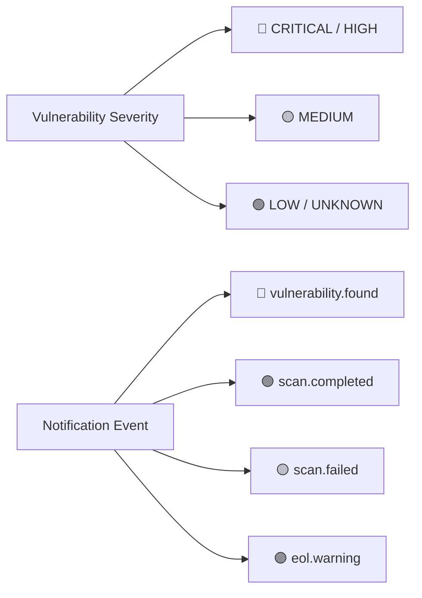

This guide defines the official design language, component conventions, Pico CSS framework extensions, and color system for the R.O.V.E.R. platform. All web interface templates (`src/rover/templates/*.html`) follow these standards to ensure visual consistency, accessibility, and clean responsive layout.

---

## 🎨 Design System Principles

1. **Semantic HTML First**: Prefer standard HTML5 elements (`<article>`, `<header>`, `<footer>`, `<nav>`, `<aside>`, `<dialog>`, `<details>`, `<summary>`, `<fieldset>`, `<grid>`) over generic unstyled `<div>` elements.
2. **Pico CSS Framework**: Built on top of **Pico CSS v2** (`data-theme="dark"` by default). Use Pico CSS semantic selectors and utility classes rather than custom CSS frameworks.
3. **Consistent Interactive Elements**: Hyperlinks that trigger actions must use `role="button"` combined with appropriate modifier classes (`primary`, `secondary`, `contrast`, `outline`).
4. **Unified Color Semantics**: Status indicators, vulnerability severity badges, and notification event pills strictly adhere to standardized color tokens.

---

## 🧩 HTML Elements & Pico CSS Features

### Structural Elements

| HTML Element | Purpose & Usage in ROVER |
| :--- | :--- |
| `<main class="container">` | Top-level content wrapper enforcing responsive max-width and horizontal margins. |
| `<article>` | Primary container card for dashboards, scan reports, form blocks, and data tables. |
| `<header>` & `<footer>` | Top header bar and bottom footer area inside cards or application pages. |
| `<div class="grid">` | Pico CSS auto-responsive grid layout for side-by-side columns. |
| `<dialog>` | Native modal dialog windows (e.g. Add Rule, Test Destination, Invitation Modals). |
| `<details>` & `<summary>` | Collapsible accordion sections (e.g., Quick Scan panel, Raw Scan JSON output). |

### Interactive Buttons & Links

Buttons and action links must use standard Pico CSS button classes and ARIA roles:

```html
<!-- Primary Action Button -->
<button type="submit">🚀 Create Product</button>

<!-- Secondary Action Link Button -->
<a href="/products/123" role="button" class="secondary">View Details</a>

<!-- Outline / Subtle Action Button -->
<a href="/admin/notifications" role="button" class="secondary outline">⚙️ Manage Destinations</a>

<!-- High-Contrast Action Button -->
<a href="/login" role="button" class="contrast">Log In</a>
```

| Component Syntax | Purpose & Visual Style |
| :--- | :--- |
| `<button>` / `<button class="primary">` | High-visibility primary action (Submit, Scan, Save). |
| `role="button" class="secondary"` | Standard neutral action button (Cancel, Back, View). |
| `role="button" class="secondary outline"` | Bordered outline button for secondary toolbar actions. |
| `role="button" class="contrast"` | High-contrast prominent button for authentication entry points. |

---

## 🎨 Self-Hosted FOSS Vector Icon System (Lucide Icons)

ROVER uses **Lucide Icons** (ISC License, 100% Permissive Open Source) for crisp, professional UI iconography across the application interface and documentation.

### 1. Zero-CDN Self-Hosted Architecture
- Icons are stored as local vector SVG files in `src/rover/static/icons/*.svg`.
- No external network or CDN calls are made. ROVER operates 100% self-contained in air-gapped environments.
- Jinja templates embed icons inline using the `{{ icon('name', size=18) }}` Jinja global helper (`src/rover/icons.py`).
- Inline SVG vectors inherit CSS text colors (`stroke: currentColor`) for seamless theme dark-mode adaptability.

### 2. Icon Usage in Templates

```jinja
<!-- Default 18px Icon -->
{{ icon('shield') }} Security Overview

<!-- Custom Size (e.g. 24px Header Icon) -->
{{ icon('rocket', size=24) }} Launch Scan

<!-- Icon with Custom CSS Class -->
{{ icon('alert-triangle', class_name='text-danger') }} Warning
```

### 3. Core Icon Set Reference

| Icon Name | Symbol Code | Application Usage |
| :--- | :--- | :--- |
| `shield` | `{{ icon('shield') }}` | ROVER brand, posture overview, security. |
| `rocket` | `{{ icon('rocket') }}` | Scan execution, activation, deployment. |
| `settings` | `{{ icon('settings') }}` | System configuration, edit settings. |
| `users` | `{{ icon('users') }}` | User management, team members, user dropdown. |
| `key` / `lock` | `{{ icon('key') }}` / `{{ icon('lock') }}` | API tokens, credential vault, authentication. |
| `bell` / `radio` | `{{ icon('bell') }}` / `{{ icon('radio') }}` | Alert subscriptions, notification destinations. |
| `book-open` | `{{ icon('book-open') }}` | Documentation and user guides. |
| `alert-triangle` | `{{ icon('alert-triangle') }}` | System alerts, errors, critical warnings. |
| `check-circle` | `{{ icon('check-circle') }}` | Success state, verified email, scan passed. |
| `clock` / `calendar` | `{{ icon('clock') }}` / `{{ icon('calendar') }}` | Scheduled scan triggers, releases. |

---

## 🏷️ Custom ROVER Utility Classes

| Class Name | Description & Usage |
| :--- | :--- |
| `.role-badge` | Compact pill badge for system roles (`system_admin`, `viewer`, `email_only`), notification scopes, and event rules. |
| `.status-pill` | Status indicator badge for scanner execution state (`running`, `completed`, `failed`, `queued`). |
| `.finding-badge` | Count badge for vulnerability severity levels (`CRITICAL`, `HIGH`, `MEDIUM`, `LOW`, `UNKNOWN`). |
| `.breadcrumb-row` | Top breadcrumb navigation wrapper. |
| `.breadcrumb-sep` | Breadcrumb chevron separator (`›`). |
| `.site-header` | Sticky top navigation bar. |
| `.user-menu-dropdown` | User profile avatar dropdown menu. |
| `.sticky-table` | Data table container with fixed headers for scan report listings. |

---

## 🎨 Color System & Palette Reference

ROVER uses a centralized, semantic color palette for vulnerability posture, notification alert tiers, and lifecycle states.



### 1. Severity & Status Colors

| Tier / State | Hex Color | Translucent Background (`rgba`) | Applied To |
| :--- | :--- | :--- | :--- |
| **Critical / Emergency** | `#ef4444` / `#f87171` | `rgba(239, 68, 68, 0.15)` | `CRITICAL` severity, `scan.failed`, error alerts, account removal. |
| **High Severity** | `#ea580c` / `#f97316` | `rgba(234, 88, 12, 0.15)` | `HIGH` severity vulnerabilities, urgent warnings. |
| **Medium / Warning** | `#f59e0b` / `#fbbf24` | `rgba(245, 158, 11, 0.15)` | `MEDIUM` severity, pending invitations, unverified alerts. |
| **Low / Pass / Verified**| `#10b981` / `#34d399` | `rgba(16, 185, 129, 0.15)` | `LOW` severity, `scan.completed`, deliverability verified state. |
| **EOL Lifecycle** | `#a855f7` / `#c084fc` | `rgba(168, 85, 247, 0.15)` | `eol.warning` lead-time rules, component lifecycle deprecations. |
| **Info / System Roles** | `#3b82f6` / `#60a5fa` | `rgba(59, 130, 246, 0.15)` | `system_admin` role badges, product scopes, active tab indicators. |

### 2. Pico CSS Theme Variable Tokens

ROVER leverages standard Pico CSS design tokens to maintain seamless dark-mode themes:

| CSS Variable | Default Value | Purpose |
| :--- | :--- | :--- |
| `--pico-background-color` | `#0f172a` / Dark Surface | Overall application body background. |
| `--pico-card-background-color` | `#1e293b` / Slate Surface | Background color for `<article>` cards and modals. |
| `--pico-border-color` | `#334155` / Muted Border | Divider lines, card outlines, table borders. |
| `--pico-color` | `#f8fafc` / Bright Text | Primary readable body text color. |
| `--pico-muted-color` | `#94a3b8` / Slate Muted | Subtitles, timestamps, secondary labels. |
| `--pico-primary` | `#3b82f6` / Accent Blue | Primary buttons, active tabs, highlights. |

---

## 📐 Layout & Template Conventions

When creating or updating templates in `src/rover/templates/`:

1. **Breadcrumbs**: Include a standard breadcrumb block at the top of the content block:
   ```html
   
   <a href="/">Dashboard</a>
   <span class="breadcrumb-sep">›</span>
   <span>Notification Subscriptions</span>
   
   ```

2. **Card Headers**: Place title and subtitle text in standard flex header layouts:
   ```html
   <div style="display: flex; justify-content: space-between; align-items: center; margin-bottom: 1.5rem;">
       <div>
           <h2>Title</h2>
           <p style="color: var(--pico-muted-color); font-size: 0.9rem;">Description text...</p>
       </div>
       <div>
           <a href="/target" role="button" class="secondary outline">Action</a>
       </div>
   </div>
   ```

3. **Forms & Modals**: Wrap form controls inside native `<fieldset>` and `<label>` tags provided by Pico CSS for automatic vertical alignment.

---

## 🪟 Modal Dialog Architecture & Design Standards

ROVER utilizes native HTML5 `<dialog>` elements integrated with Pico CSS modal styling and encapsulated JavaScript handlers.

### 1. Form & Content Modals (`<dialog>`)

Custom content modals (e.g. Create Product, Create Release, Add Asset, Create Notification Rule, Generate Token) follow a unified, self-contained structure:

```html
<dialog id="create-rule-modal">
    <article style="max-width: 600px;">
        <header>
            <button aria-label="Close" rel="prev" onclick="this.closest('dialog').close();"></button>
            <strong>Add Notification Rule</strong>
        </header>
        <form action="/api/notifications/rules" method="POST" style="margin-bottom: 0;">
            <fieldset>
                <label>Rule Name
                    <input type="text" name="name" required placeholder="e.g. Production Security Alerts">
                </label>
                <!-- Additional form fields -->
                <button type="submit">Save Rule</button>
            </fieldset>
        </form>
    </article>
</dialog>
```

#### Key Rules for Custom Modals:
- **Encapsulated Close Button**: Header close buttons MUST use `onclick="this.closest('dialog').close();"` rather than hardcoded element IDs.
- **Card Wrapper**: Direct child of `<dialog>` MUST be an `<article>` to enforce card padding, dark-mode background, and backdrop bounds.
- **Global Backdrop Dismissal**: Global listener in `base.html` automatically detects clicks outside `<article>` on the backdrop and closes the dialog.
- **Automatic Form Reset**: Global listener in `base.html` catches the dialog `'close'` event and clears form fields so modals open with fresh state.

---

### 2. Programmatic Confirmation Modal (`openGlobalConfirmModal`)

For destructive or critical confirmation steps (Delete Product, Delete Release, Delete Asset, Revoke API Token), ROVER provides a centralized programmatic modal (`#global-confirm-modal` in `base.html`).

#### Programmatic Invocation:

```javascript
// Simple Confirmation
openGlobalConfirmModal({
    title: 'Delete Asset',
    message: 'Are you sure you want to remove asset <strong>v1.2.0</strong> from this release?',
    actionUrl: '/releases/rel_123/assets/ast_456/delete',
    buttonText: 'Delete Asset'
});

// Destructive Action with Mandatory Verification Typing
openGlobalConfirmModal({
    title: 'Delete Product',
    message: 'This will permanently purge this product and all associated releases and scan history.',
    actionUrl: '/products/prod_123/delete',
    buttonText: 'Permanently Delete',
    requireTyping: true,
    expectedText: 'core-api-service'
});
```

#### Modal Options Schema:

| Property | Type | Default | Description |
| :--- | :--- | :--- | :--- |
| `title` | `string` | `'Confirm Action'` | Header text displayed in red highlight. |
| `message` | `string` | `'This action is irreversible.'` | HTML message body describing consequences. |
| `actionUrl` | `string` | *(Required)* | Form submission target endpoint URL. |
| `actionValue` | `string` | `'delete'` | Value assigned to hidden `name="action"` field. |
| `buttonText` | `string` | `'Confirm'` | Label for the red submit button. |
| `requireTyping` | `boolean` | `false` | When `true`, disables the submit button until the user types `expectedText`. |
| `expectedText` | `string` | `'I understand'` | Exact text the user must type to unlock confirmation. |

