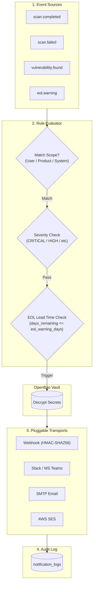

# Notification System Architecture

> **Summary**: Event-driven notification architecture for R.O.V.E.R. supporting per-user, per-product, and system-wide notification rules, OpenBao Vault credential integration, advance EOL warning thresholds, and multi-channel transports (Webhooks, Slack, MS Teams, SMTP, AWS SES).

---

## 1. Overview & Core Principles

The R.O.V.E.R. Notification Framework connects system evaluation events (scan completion, scan failure, vulnerability detection, EOL warnings) to user-configured notification destinations.

### Key Architectural Tenets
1. **Multi-Scope Ownership**: Destinations and rules can be configured at **User Level** (personal subscriptions), **Product Level** (team channels), or **System Level** (admin operations).
2. **OpenBao Vault Credential Security**: Webhook HMAC secrets, SMTP passwords, and AWS SES credentials are stored encrypted in OpenBao Vault rather than plaintext database columns.
3. **Advance EOL Warning Engine**: EOL notifications support configurable advance lead times (e.g. 90, 120, 180 days prior to EOL date) allowing teams to plan component upgrades before support deprecation.
4. **Asynchronous Dispatch**: Notification delivery is executed asynchronously via background worker tasks to avoid blocking scanner loops or web requests.
5. **Pluggable Transports**: Transport adapters isolate provider-specific payload formatting (Slack Blocks, Teams Adaptive Cards, AWS SES, SMTP, Webhook HMAC signatures).
6. **Email Verification Gate**: Email destinations and user email addresses require confirmation via signed 24-hour verification tokens (`/confirm-email?token=...`) before active email alerts are dispatched.
7. **Self-Service Subscription Portal**: Users (including `email_only` users) can manage email verification status, resend confirmation links, and execute single or bulk (**Unsubscribe All**) subscription removals at `/user/subscriptions`.

---

## 2. Event & Rule Matching Engine

---

## 3. Modular Units of Work & Implementation Units

The implementation of the Notification Architecture is broken down into 6 discrete, sequential units of work. Each unit has explicit scope and verifiable acceptance criteria:

### Unit 1: Notification Destinations & OpenBao Vault Integration
- **Scope**:
  - `notification_destinations` DB schema supporting `user_id`, `product_id`, and `is_system` scope.
  - Destination types: `webhook`, `slack`, `smtp`, `aws_ses`.
  - Vault secret path helpers for storing `smtp_password`, `aws_secret_key`, and `webhook_secret`.
- **Success Criteria**:
  - DB schema created and migrated.
  - Vault integration methods tested with mock Vault client.
  - Unit tests in `tests/test_notifications.py` passing cleanly.

### Unit 2: Per-User & Product Rule Engine with EOL Warning Lead-Times
- **Scope**:
  - `notification_rules` DB schema supporting event types (`scan.completed`, `scan.failed`, `vulnerability.found`, `eol.warning`), minimum severity threshold (`CRITICAL`, `HIGH`, `MEDIUM`, `LOW`, `ALL`), and **`eol_warning_days`** (INTEGER advance warning lead time, e.g. 90, 120, 180 days).
  - Rule evaluation function matching active events against registered rules.
- **Success Criteria**:
  - EOL evaluation logic fires alerts when `days_remaining <= eol_warning_days`.
  - Severity threshold filter correctly suppresses alerts below configured threshold.
  - Unit tests verifying rule matching for user-level and product-level scopes.

### Unit 3: Pluggable Transports (Webhook, Slack/Teams, SMTP, AWS SES)
- **Scope**:
  - `src/rover/notifications/transports/` module hierarchy implementing standard `deliver_notification(destination, payload, vault_secret)` signature.
  - `WebhookTransport`: HTTP POST with HMAC-SHA256 signature (`X-Rover-Signature`).
  - `SlackTransport`: Slack Block Kit JSON formatting.
  - `SmtpTransport`: Standard library `smtplib` TLS/STARTTLS message delivery.
  - `AwsSesTransport`: AWS SES API integration via `urllib`/botocore.
- **Success Criteria**:
  - Each transport tested via unit tests with HTTP/SMTP mocks.
  - HMAC signatures verified against expected HMAC-SHA256 test digests.

### Unit 4: Async Dispatch Engine & Audit Log (`notification_logs`)
- **Scope**:
  - `notification_logs` DB schema for tracking delivery attempts, HTTP status codes, error messages, and retry counts.
  - Async worker task queue offloading delivery tasks without blocking web requests or scanner execution.
- **Success Criteria**:
  - Delivery attempts recorded in `notification_logs`.
  - Non-blocking async execution verified under test load.

### Unit 5: User Settings & Product Notification Management UI
- **Scope**:
  - User Settings UI (`/user/settings/notifications`) for managing personal destinations and subscriptions.
  - Product Settings UI (`/products/{product_id}/settings/notifications`) for managing product channels.
  - Test Ping action (`POST /api/notifications/destinations/{id}/test`) sending instant test payload.
- **Success Criteria**:
  - Users can configure personal email/webhook destinations and set EOL warning lead times.
  - Product admins can configure team channels and severity filters.
  - Test ping button renders immediate status feedback in UI.

### Unit 6: Astro Starlight Documentation & Guide
- **Scope**:
  - Comprehensive guide in `docs/starlight/src/content/docs/guides/notifications.md`.
- **Success Criteria**:
  - Clear user instructions for configuring Webhooks, Slack, SMTP, AWS SES, and EOL lead times.
  - Built cleanly via `poe docs-build`.

---

## 4. Relationships & Related Notes

- **Parent Index**: [[roadmap-moc|ROVER Roadmap Map of Content]]
- **Related Milestone Notes**:
  - [[m6-notifications|Milestone 6: Notifications System]]
  - [[m13-outbound-webhooks|Milestone 13: Outbound Webhooks Integration]]
  - [[m1-credential-management|Milestone 1: Credential Vault]]
