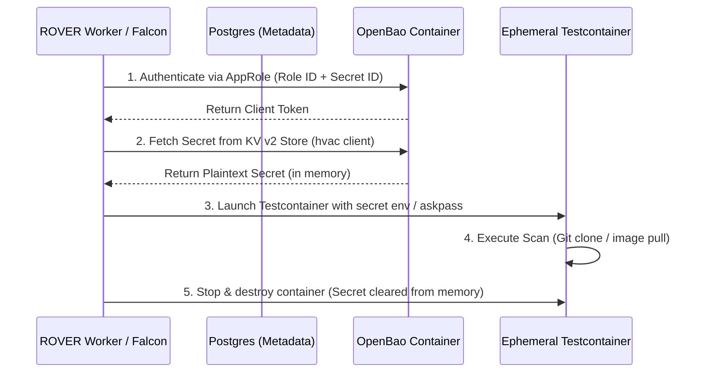

# OpenBao Dynamic Secret Injection

> **Summary**: R.O.V.E.R requires sensitive credentials (private Git tokens, registry auth, Snyk tokens, SMTP passwords) for vulnerability scans. Scans execute inside ephemeral Testcontainers. Docker Secrets fail here because they are immutable and bind at deploy-time. ROVER uses **OpenBao** (an open-source, MPL-licensed fork of Vault with full API compatibility) for dynamic runtime secret injection.

## 1. Architectural Motivation & Rationale

- **License Risk Avoidance**: HashiCorp Vault transitioned to BSL (Business Source License). OpenBao provides a community-governed, open-source alternative retaining API compatibility.
- **Ephemeral Container Injection**: Secrets must be injected into ephemeral Testcontainers at runtime without persisting plaintext secrets to disk or container images.

---

## 2. Dynamic Secret Execution Flow

1. **Storage**: OpenBao runs as a dedicated service container (`openbao/openbao:latest`) alongside Falcon, Authelia, and Postgres. Secret metadata is recorded in the PostgreSQL `credentials` table.
2. **Authentication**: Falcon and `worker.py` authenticate against OpenBao using a machine-to-machine AppRole (`src/rover/vault.py`).
3. **Retrieval**: Falcon requests unmasked secret values from OpenBao's Key-Value (KV v2) engine using the `hvac` Python client.
4. **Injection**: Falcon retrieves the plaintext secret into memory and passes it to the ephemeral Testcontainer instance via environment variables or `GIT_ASKPASS`.
5. **Cleanup**: The Testcontainer completes the scan and terminates. Both the container filesystem and in-memory secrets are destroyed together.

---

## 3. Related Concepts & Resources
- **Upstream Tool Reference**: [[openbao|OpenBao Resource]]
- **Credential Management Milestone**: [[m1-credential-management|M1 · Credential Management]]
- **Plugin Specification**: [[rover-scanner-plugin-specification]]
- **Map of Content**: [[roadmap-moc|ROVER Roadmap Map of Content]]
