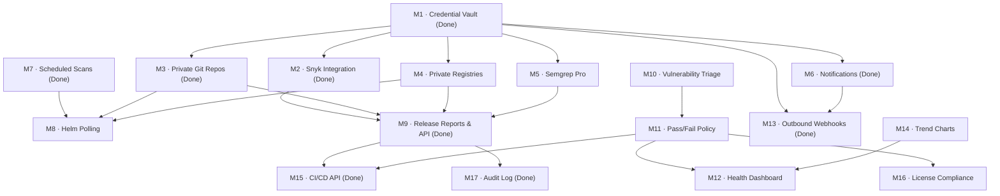

# ROVER Feature Roadmap Map of Content

> **Scope**: Central tracking index mapping all completed, planned, and architectural milestones for R.O.V.E.R (Release Oriented Vulnerability Evaluation & Reporting).

---

## 📊 Milestone Progress Matrix

| Category | Milestone Range | Completed | Planned | Total |
| :--- | :--- | :---: | :---: | :---: |
| **Core Features & Scanners** | M1 – M9 | 6 (M1, M2, M3, M6, M7, M9) | 3 | 9 |
| **Operational MVP Gaps** | M10 – M13 | 1 (M13) | 3 | 4 |
| **High-Value Additions** | M14 – M17 | 2 (M15, M17) | 2 | 4 |
| **Architectural Targets** | A1 – A7 | 5 (A1–A4, A7) | 2 | 7 |
| **Total** | | **14** | **10** | **24** |

---

## 🔗 Milestone Dependency Graph

---

## 🚀 Feature Milestones

### Core Scopes & Integrations (Milestones 1–9)
- [[m1-credential-management|M1 · Credential Management]] ✅ *(Completed)*
- [[m2-snyk-integration|M2 · Snyk Integration]] ✅ *(Completed)*
- [[m3-private-source-repository-support|M3 · Private Source Repository Support]] ✅ *(Completed)*
- [[m4-private-container-registry-support|M4 · Private Container Registry Support]]
- [[m5-semgrep-pro-authentication|M5 · Semgrep Pro Authentication]]
- [[m6-notifications|M6 · Notifications System]] ✅ *(Completed)*
  - [[email-verification-and-unsubscribe-portal|Email Verification & Unsubscribe Portal Architecture]]
- [[m7-scheduled-scans|M7 · Scheduled Scans Engine]] ✅ *(Completed)*
- [[m8-helm-chart-version-polling|M8 · Helm Chart Version Polling & Auto Promotion]]
- [[m9-release-reports-and-api|M9 · Release Reports & Export API]] ✅ *(Completed)*

### Operational MVP Gaps (Milestones 10–13)
- [[m10-vulnerability-triage-and-finding-status|M10 · Vulnerability Triage & Finding Status]]
- [[m11-pass-fail-policy-rules|M11 · Pass/Fail Policy Rules Engine]]
- [[m12-cross-product-health-dashboard|M12 · Cross-Product Health Dashboard]]
- [[m13-outbound-webhooks|M13 · Outbound Webhooks Integration]] ✅ *(Completed)*

### High-Value Additions (Milestones 14–17)
- [[m14-vulnerability-trend-charts|M14 · Vulnerability Trend Charts]]
- [[m15-ci-cd-integration-api|M15 · CI/CD Integration API & CLI]] ✅ *(Completed)*
- [[m16-license-compliance|M16 · Open Source License Compliance]]
- [[m17-audit-log|M17 · Security Audit Log]] ✅ *(Completed)*

---

### Architectural Engineering Targets (A1 – A11)
- [[a1-scanner-plugin interface|A1 · Scanner Plugin Interface]] ✅ *(Completed)*
- [[a2-route-decomposition|A2 · Falcon Route Decomposition]] ✅ *(Completed)*
- [[a3-database-layer-decomposition|A3 · Database Access Layer Decomposition]] ✅ *(Completed)*
- [[a4-schema-migrations|A4 · SQL Schema Migrations]] ✅ *(Completed)*
- [[a5-typed-domain-models|A5 · Typed Domain Models]]
- [[a6-structured-logging|A6 · Structured JSON Logging]]
- [[a7-concurrent-job-execution|A7 · Concurrent Background Job Execution]] ✅ *(Completed)*
- [[lldap-identity-backend|A8 · LLDAP Identity Provider Integration]]
- [[ephemeral-authelia-provisioner|A9 · Ephemeral Cryptographic Handoff Authelia Provisioner]]
- [[hybrid-identity-rbac-architecture|A10 · Hybrid Identity & Access Governance Architecture]] ✅ *(Completed)*
- [[user-roles-and-product-permissions|A11 · User Roles & Product Permissions Architecture]] ✅ *(Completed)*
- [[design-language-and-ui-standards|A12 · Design System & UI Standards Architecture]] ✅ *(Completed)*
